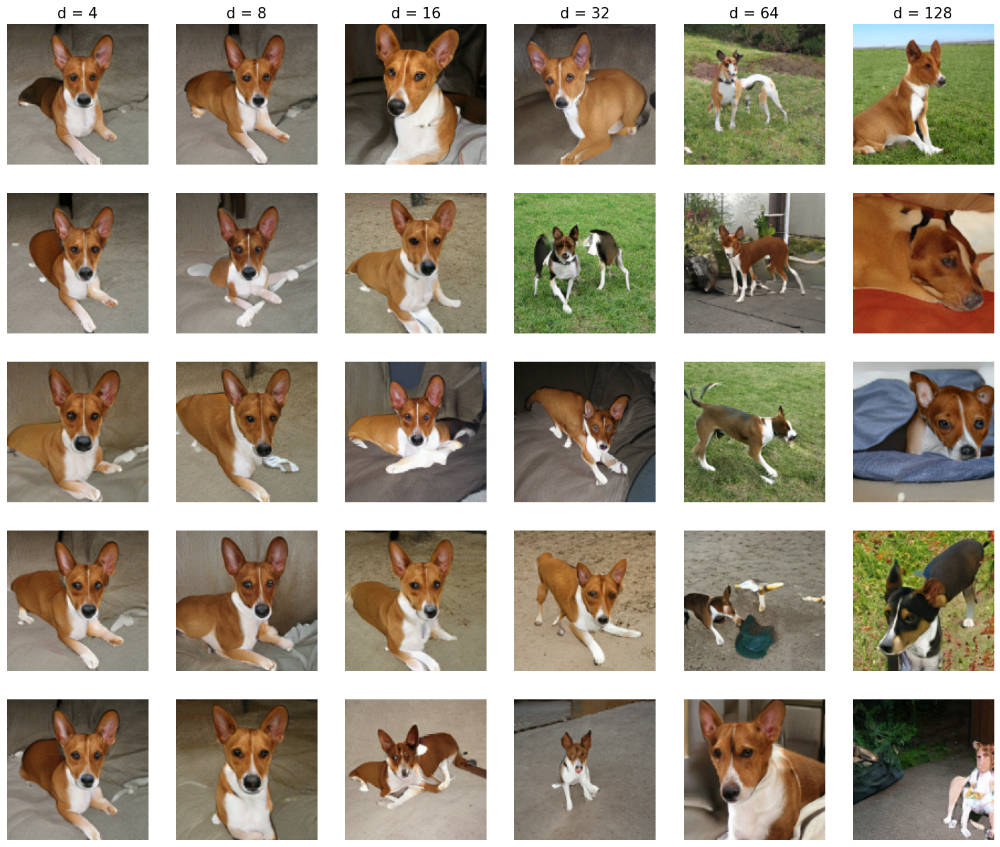
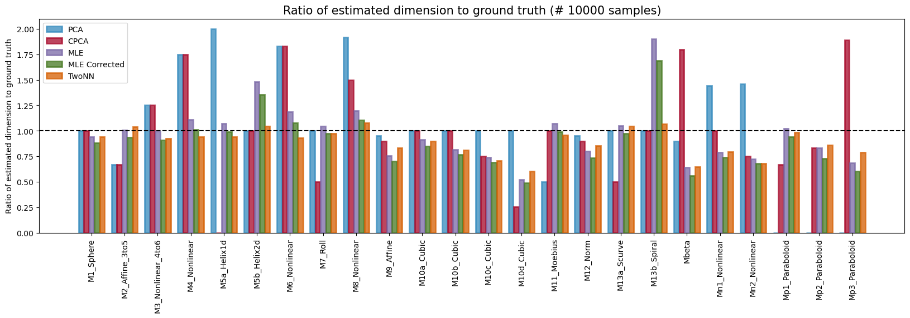
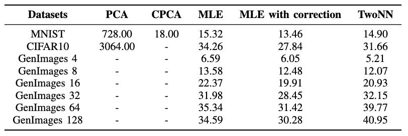

# Intrinsic Dimension of Images
Real-world datasets often possess an intrinsic dimension hidden within their large extrinsic dimension. Evaluating the performance of intrinsic dimension estimators is challenging because of high dimensional datasets and no known real-life datasets with the true intrinsic dimension to verify. This study compares different algorithms on chosen datasets to discern their efficacies in capturing intrinsic dimensionalities. We conduct a comprehensive analysis of toy datasets to evaluate the algorithms by running a battery of experiments. To address the real-life dataset problem, we leverage pre-trained generative models to generate synthetic datasets with known intrinsic dimensions close to real-life datasets, establishing a benchmark for evaluating different estimators. This approach will help refine the dimensionality reduction methodologies, build a reliable intrinsic dimension estimator and give insights into the underlying data distribution.

## Running Code
Toy Datasets
```
python main.py --dataset="toy" --device="cpu" --batch_size=1000
```

MNIST Dataset
```
python main.py --dataset="MNIST" --device="cpu" --batch_size=1000
```

CIFAR10 Dataset
```
python main.py --dataset="CIFAR10" --device="cpu" --batch_size=1000
```

Generated Image Datasets
For generating the dataset with the desired intrinsic dimension run ```generate.sh``` file first, by changing the hyperparameters as desired. The code for generating the dataset is taken from [this repository](https://github.com/ppope/dimensions). For estimating the intrinsic dimensions,
```
python main.py --dataset="generated" --device="cpu" --batch_size=1000 --latent_dim=16
```

where the ```latent_dim``` variable is set according to the dataset.

## Results
<figure>
  
  <figcaption>The figure illustrates samples from generated image datasets, each column depicting a distinct intrinsic dimension as indicated at the top of the respective column.</figcaption>
</figure>

<figure>
  
  <figcaption>The figure illustrates the analysis of intrinsic dimension estimators on toy datasets sourced from scikit-dimension. The y-axis in the accompanying bar plot represents the ratio between the estimated intrinsic dimension and the ground truth intrinsic dimension, while the x-axis showcases different datasets.</figcaption>
</figure>

<figure align="center">
  
  <figcaption>Intrinsic Dimension Estimates for Various Datasets.</figcaption>
</figure>


